# VisionAnalytica 🔍
### AI-Powered Traffic Violation Detection

VisionAnalytica is a state-of-the-art computer vision system for detecting traffic violations in real-time. It uses a **Dual-YOLO pipeline** with **ROI Zooming** to accurately detect motorcycle riders, classify helmet usage, and identify triple-riding violations — even in crowded Indian traffic scenes.

---

## ⚙️ Tech Stack

| Layer | Technology |
|---|---|
| **Frontend** | React 19, Vite, TypeScript, Tailwind CSS |
| **Backend** | FastAPI, Python 3.10+, Ultralytics |
| **Base Model** | `yolo11s.pt` (COCO — persons & motorcycles) |
| **Helmet Model** | [`yolov11m(100epochs).pt`](https://huggingface.co/nnsohamnn/helmet-detection-yolo11) (custom fine-tuned) |

---

## 🧠 Detection Pipeline

The system uses a **5-stage hybrid pipeline** that combines ROI Zooming for small-object detection with dual matching (head-based + person-based fallback) for robust rider counting.

### Overview

```mermaid
flowchart TB
    A["📸 Input Image"] --> B["STAGE 1\nBase Detection\n(YOLO11s)"]
    B --> C["STAGE 2\nMulti-Scale Helmet Detection\n(ROI Zooming)"]
    C --> D["STAGE 3\nHybrid Matching\n(Head + Person Fallback)"]
    D --> E["STAGE 4\nViolation Assembly"]
    E --> F["📊 Results + UI Overlay"]

    style A fill:#1e293b,stroke:#3b82f6,color:#e2e8f0
    style B fill:#1e293b,stroke:#10b981,color:#e2e8f0
    style C fill:#1e293b,stroke:#f59e0b,color:#e2e8f0
    style D fill:#1e293b,stroke:#8b5cf6,color:#e2e8f0
    style E fill:#1e293b,stroke:#ef4444,color:#e2e8f0
    style F fill:#1e293b,stroke:#3b82f6,color:#e2e8f0
```



---

### Stage 1 — Base Detection (`yolo11s.pt`)

Detects all **persons** (class 0) and **motorcycles** (class 3) in the image using YOLO11s at 640px input resolution. YOLO11s provides ~20% better mAP than YOLO11n while remaining fast enough for real-time use.

```mermaid
flowchart LR
    A["Full Image\n(1920×1080)"] -->|"resize to 640px"| B["YOLO11s\nconf=0.25"]
    B --> C["Persons\n(class 0)"]
    B --> D["Motorcycles\n(class 3)"]

    style A fill:#0f172a,stroke:#64748b,color:#e2e8f0
    style B fill:#1e293b,stroke:#10b981,color:#e2e8f0
    style C fill:#1e293b,stroke:#3b82f6,color:#e2e8f0
    style D fill:#1e293b,stroke:#3b82f6,color:#e2e8f0
```



---

### Stage 2 — Multi-Scale Helmet Detection (ROI Zooming)

**The core innovation.** In a typical traffic image, a rider's head is only ~15-25px after downscale to 640px. The helmet model struggles with such tiny heads. ROI Zooming solves this by running the model at multiple scales:


**Asymmetric Confidence Thresholds:**

| Class | Threshold | Rationale |
|---|---|---|
| `Without Helmet` | `0.12` | Low bar — bias toward catching violations |
| `With Helmet` | `0.35` | Higher bar — reduce false positives (caps, turbans) |

**Safety-First NMS:** When full-image and ROI-zoom produce conflicting labels for the same head (e.g., full says "Helmet" at 0.40, ROI says "No Helmet" at 0.35), NMS **prefers "No Helmet"** — it's better to flag a potential violation than to miss one.

---

### Stage 3 — Hybrid Matching (Head + Person Fallback)

This stage determines **who is riding which motorcycle** and whether they have a helmet. It uses two complementary signals:

```mermaid
flowchart TB
    subgraph Primary ["Primary: Head → Motorcycle"]
        direction TB
        H["Head detections"] -->|"head center horizontally\nwithin moto span (±30%)"| M1{"Above a\nmotorcycle?"}
        M1 -->|"Yes"| R1["Rider with\nknown helmet status"]
        M1 -->|"No"| P1["Not a rider"]
    end

    subgraph Fallback ["Fallback: Person → Motorcycle"]
        direction TB
        PD["Unmatched persons\n(no head detected)"] --> CHK{"4 geometric checks"}
        CHK -->|"height < 1.5× moto\nbottom near moto bottom\nhorizontal overlap\nvertical overlap > 30%"| R2["Rider with\nunknown helmet ⚠️"]
        CHK -->|"Fails checks"| P2["Pedestrian"]
    end

    R1 --> FINAL["Combined Rider Count\nper motorcycle"]
    R2 --> FINAL

    style Primary fill:#0f172a,stroke:#8b5cf6,color:#e2e8f0
    style Fallback fill:#0f172a,stroke:#eab308,color:#e2e8f0
    style FINAL fill:#1e293b,stroke:#10b981,color:#e2e8f0
```



**Why both signals?**

| Signal | Strength | Weakness |
|---|---|---|
| Head detection → motorcycle | Precise helmet classification | Misses undetected heads entirely |
| Person box → motorcycle | Catches all riders (YOLO11s is reliable at people) | Can confuse standing people |
| **Hybrid (both)** | **Best of both** — accurate helmet status when available, correct rider count always | — |

**Fallback Rider Filters** (prevents counting standing pedestrians):
1. Person height < 1.5× motorcycle height
2. Person's bottom edge within 50% of motorcycle's bottom
3. Horizontal center within motorcycle span (±30%)
4. Vertical overlap > 30%

---

### Stage 4 — Violation Assembly

```mermaid
flowchart LR
    subgraph Violations
        direction TB
        V1["🚫 No Helmet\n(severity: high)\nHead detected as\n'Without Helmet'\non a motorcycle"]
        V2["⚠️ Helmet Unknown\n(severity: medium)\nFallback rider — no head\ndetected, can't confirm helmet"]
        V3["🏍️ Triple Riding\n(severity: high)\nMore than 2 riders\non one motorcycle"]
    end

    style V1 fill:#1e293b,stroke:#ef4444,color:#e2e8f0
    style V2 fill:#1e293b,stroke:#f59e0b,color:#e2e8f0
    style V3 fill:#1e293b,stroke:#f97316,color:#e2e8f0
```



---

### End-to-End Example

```mermaid
flowchart LR
    IMG["🖼️ Traffic scene\n3 motorcycles\n8 people"] --> S1["Stage 1\n8 persons\n3 motorcycles"]
    S1 --> S2["Stage 2\n5 head detections\n(3 helmet, 2 no-helmet)"]
    S2 --> S3["Stage 3\n5 heads → 3 bikes\n2 persons → fallback"]
    S3 --> S4["Stage 4\n✅ 2 no-helmet\n⚠️ 2 unknown\n🏍️ 1 triple-riding"]

    style IMG fill:#0f172a,stroke:#64748b,color:#e2e8f0
    style S1 fill:#1e293b,stroke:#10b981,color:#e2e8f0
    style S2 fill:#1e293b,stroke:#f59e0b,color:#e2e8f0
    style S3 fill:#1e293b,stroke:#8b5cf6,color:#e2e8f0
    style S4 fill:#1e293b,stroke:#ef4444,color:#e2e8f0
```



---

## 🚀 Getting Started

### 1. Clone the Repository
```bash
git clone https://github.com/Dream-blue-wasTaken/traffic_analysis.git
cd traffic_analysis
```

### 2. Backend Setup
```bash
cd backend

# Create and activate virtual environment
python -m venv venv
.\venv\Scripts\activate       # Windows
# source venv/bin/activate    # Linux/Mac

# Install dependencies
pip install -r ../requirements.txt

# Run the backend server
python main.py
```
> The server starts at `http://localhost:8000`. On first run, it downloads `yolo11s.pt` (~19MB, one-time).

### 3. Frontend Setup
```bash
cd frontend

# Install dependencies
npm install

# Run the app
npm run dev
```
> Access the application at `http://localhost:5173`.

---

## 📂 Repository Structure

```
traffic_analysis/
├── backend/
│   └── main.py              # 5-stage detection pipeline (FastAPI)
├── frontend/
│   ├── App.tsx               # Main UI with violation summary panel
│   ├── components/
│   │   └── DetectionOverlay.tsx  # Bounding box rendering
│   └── services/
│       └── yoloService.ts    # API client + TypeScript interfaces
├── weights/                  # Cached model weights
│   └── yolov11m(100epochs).pt
└── requirements.txt          # Python dependencies
```

## 🛠️ Prerequisites

- **Node.js**: v18+
- **Python**: 3.9+
- **GPU (Optional)**: CUDA-enabled PyTorch for faster inference

## 📊 Frontend UI

| Element | Color | Meaning |
|---|---|---|
| 🟢 Green person box | `#10b981` | Rider with helmet confirmed |
| 🔴 Red person box | `#ef4444` | Rider without helmet (violation) |
| 🟡 Yellow person box | `#eab308` | Rider with unknown helmet status |
| ⬜ Gray dashed box | `#6b7280` | Pedestrian (not on motorcycle) |
| 🔵 Blue motorcycle box | `#3b82f6` | Motorcycle (normal) |
| 🟠 Orange motorcycle box | `#f97316` | Motorcycle (triple-riding violation) |

---

*Built with ❤️ using YOLO11 + FastAPI + React*